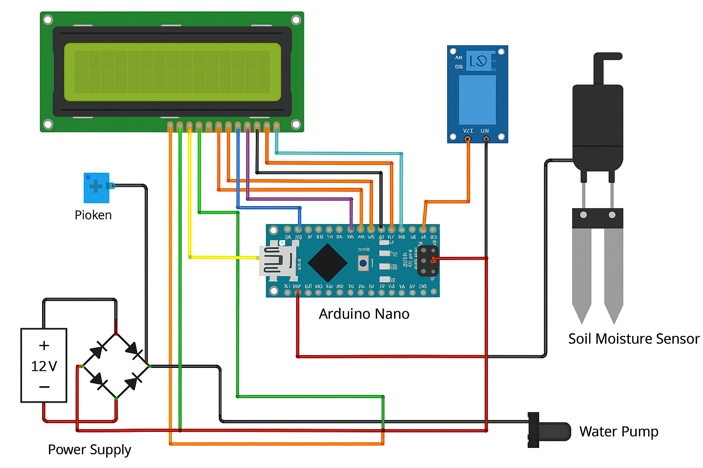
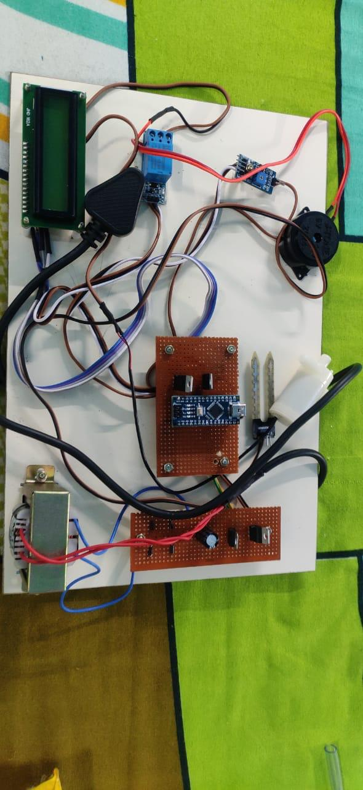

# automatic Irrigation System 🌱💧

An automated irrigation system that waters plants based on soil moisture levels.

## Components Used
- Arduino Uno / ESP8266
- Soil Moisture Sensor
- Relay Module
- Water Pump
- Jumper Wires
- Breadboard

## Working
- The soil moisture sensor detects the dryness of the soil.
- If soil is dry, the microcontroller activates the relay and starts the water pump.
- Watering stops automatically when the required moisture level is reached.

## Images

## Files
- `code/automatic_irrigation.ino` – Arduino code
- `images/` – Circuit and setup photos
- `docs/project_report.pdf` – Project report and explanation

## Applications
- Home gardening
- Smart agriculture
- Greenhouses
